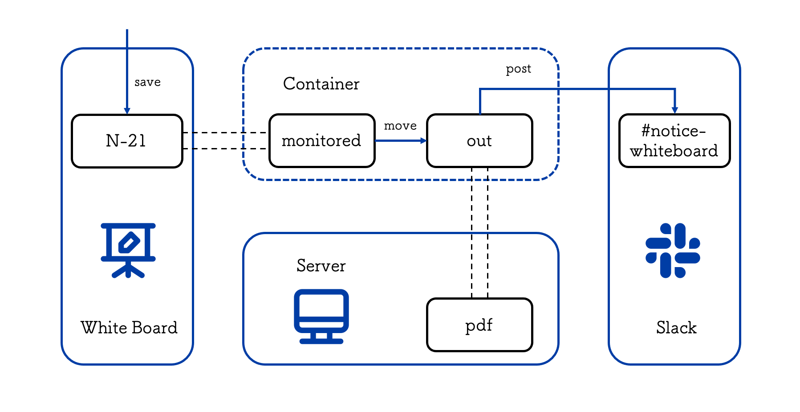

# nomo

<p align="left">
  
<p>

Innovation on the whiteboard in the seminar room!

# About nomo

<p align="center">
  
<p>

## Install
`SLACK_CHANNEL`=#notice-whiteboard, `SLACK_API_TOKEN`=***
```bash
# Setting Environment 
$ cp .env.sample .env
$ vim .env

# Setting Directory
$ mkdir N-21 pdf
$ mount <USB-device Path> N-21
```
**Notice**: USB-device name must be fixed or not change dynamically.

## Implemented Commands
The commands are implemented by Makefile.

### Build Docker image
```bash
$ make build
```

### Execute process
```bash
# Start container
$ make run

# Stop container
$ make stop
```

### Test process
```bash
$ make test
```
